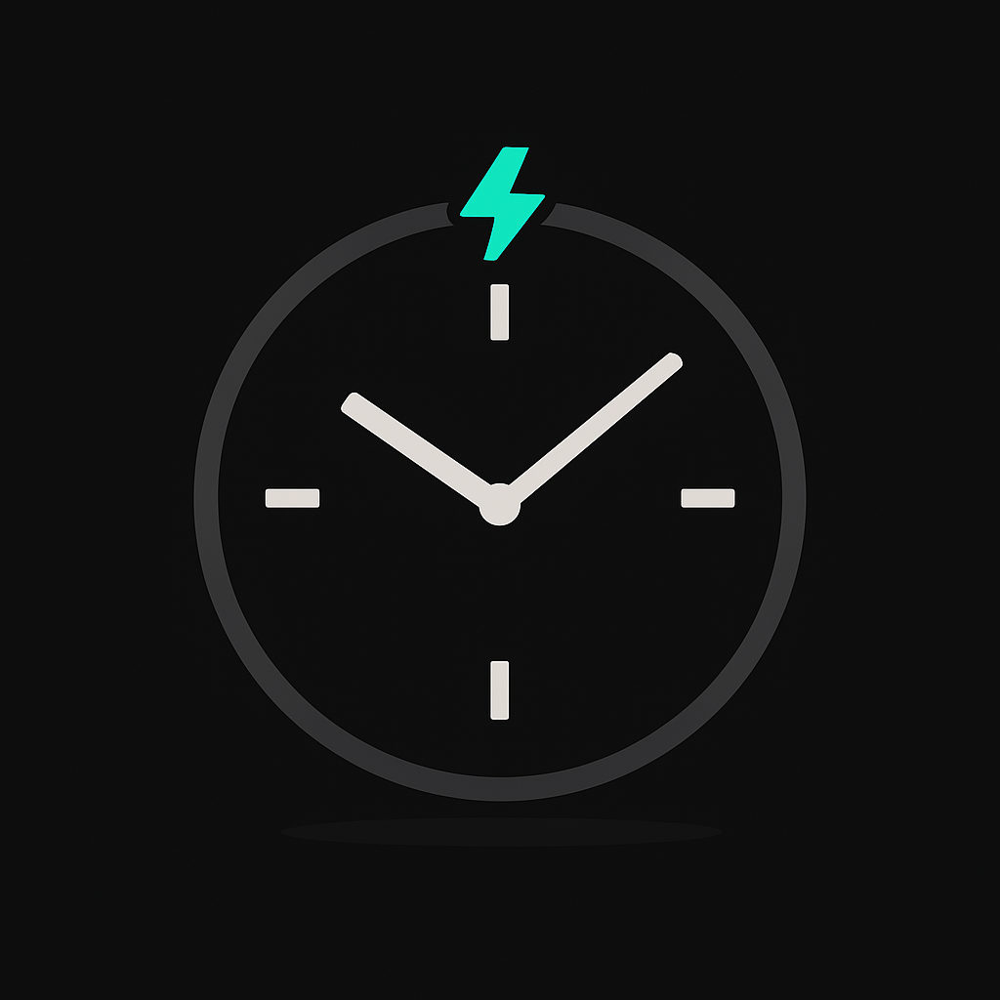
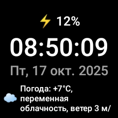
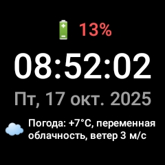
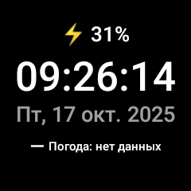

#  Watch Minimal

A tiny, battery-friendly **watchface-like Android app** for non-WearOS watches (Android 8.1+ devices that behave like phones like Aimoto G4). It shows battery, time with seconds, date with weekday, **current weather (Open-Meteo, no API key)** with an emoji icon, and **steps “today.”** Optional (not realized) launcher/keep-alive setup keeps it always on screen. Text is only in Russian now.









---

## Features

- **Time** — HH:mm:ss, auto-sizes to fit small round/square screens.
    
- **Date** — localized weekday + date (e.g., `Mon, 6 Oct 2025`).
    
- **Battery indicator**
    
    - Charging → **green** text with **⚡** prefix
        
    - <20% (and not charging) → **red** text
        
    - Otherwise → white with **🔋** prefix
        
- **Weather** — Open-Meteo (no key), updates on launch and every **30 min**:
    
    - Temperature (°C), condition (WMO→RU mapping), wind (m/s)
        
    - Weather **emoji icon** based on WMO code
        
    - Uses last known location; falls back to **configurable default coords**
    
- **Big, readable UI** — large typography, high contrast for outdoor readability.
    

---

## Version

**Current:** `1.0.0`

- Baseline features above
    
- No Wear OS dependency; runs as a normal Android app
    

> Tip: You can optionally set it as the **Home (Launcher)** on the watch or run a lightweight **foreground service** to keep the app/process alive (see _Keep Alive Options_).

---

## Tech & Requirements

- **Min SDK:** 26 (Android 8.0)
    
- **Target SDK:** 28 (project config), **compileSdk:** 34
    
- **Language:** Java
    
- **Sensors:** `TYPE_STEP_COUNTER` (optional)
    
- **Network:** HTTPS to Open-Meteo
    

### Dependencies

- `androidx.core:core:1.12.0`
    
- `androidx.appcompat:appcompat:1.6.1`  
    _(no Wear libs, no Material 3 required)_
    

---

## Permissions

Required:

- `INTERNET`, `ACCESS_NETWORK_STATE` — weather fetch
    
- `ACCESS_FINE_LOCATION`, `ACCESS_COARSE_LOCATION` — last known location for weather
    

Optional (only if you enable keep-alive service / boot handling):

- `RECEIVE_BOOT_COMPLETED` — auto start after reboot
    
- `WAKE_LOCK` — reliability around wake/unlock events
    

Feature (optional):

- `<uses-feature android.hardware.sensor.stepcounter android:required="false" />`
    

---

## Configuration

Inside `MainActivity.java`:

- **Weather interval:** `WEATHER_INTERVAL_MS = 30 * 60 * 1000L`
    
- **Default location:**
    
    ```java
    private static final double DEFAULT_LAT = 55.751244; // Moscow (by default)
    private static final double DEFAULT_LON = 37.618423;
    ```
    
    Change to your city if you don’t grant location.
    
- **Battery colors:**
    
    ```java
    #FFFFFF (normal), #00E676 (charging), #FF5252 (low)
    ```
    

---

## Keep Alive Options (Optional)

### 1) Make it the **Launcher (Home)**

Add a second intent filter to `MainActivity`:

```xml
<intent-filter>
  <action android:name="android.intent.action.MAIN"/>
  <category android:name="android.intent.category.HOME"/>
  <category android:name="android.intent.category.DEFAULT"/>
</intent-filter>
```

After installation, set it as the default Home. This guarantees the app shows after unlock.

### 2) Lightweight **Foreground Service**

Add `KeepAliveService` + `BootReceiver` (start on boot, keep process sticky, reopen UI on unlock via `ACTION_USER_PRESENT`). On Android 8.1 this works without extra runtime permissions.

> Some OEM firmwares still kill background apps aggressively. Add the app to battery optimization exceptions if the device offers that setting.

---

##  Checklist

- Time auto-sizes on round & square screens (smallest watch DPI).
    
- Battery colors & ⚡ on charge, <20% red.
    
- Weather:
    
    - Works with no location (falls back to defaults).
        
    - Loss of network shows graceful “no data”.
        
- Steps: increments and resets at midnight; survives app/device restart.
    
- Orientation/resume: no ANRs; no UI jank on 1-sec ticks.
    
- Cold boot & device reboot (if keep-alive/boot receiver enabled).
    
---

## Privacy

- Location is used **locally** to query Open-Meteo over HTTPS.
    
- No analytics or third-party SDKs.
    
- No data is stored or transmitted beyond the weather request.
    

**Attribution:** Weather data by **open-meteo.com** (free, no API key).

---


## License

TBD by the project owner (e.g., MIT/Apache-2.0).
